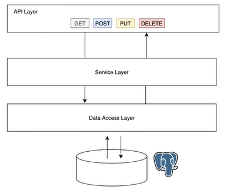

# Java Spring Boot
> APIs created with Java Spring Boot

## Student API  


Simple API with N-Tier Architecture providing services for ```Student``` objects

### Technologies
- Java Spring Boot
- Java Persistence API (JPA)
- PostgreSQL

### Endpoints
**GET**  
`api/v1/student`  

**POST**  
`api/v1/student`
```
Body
{
    "name": "John Doe",
    "email": "john.doe@email.com",
    "dob": "2021-01-01"
}
```

**DELETE**  
`api/v1/student/:id`

**PUT**  
`api/v1/student/:id?name=John&email=john@email.com`
```
Params
name : String [optional]  
email : String [optional]  
```

### Run and Compile
These steps assume that the database is already running. To edit the configuration file, navigate into `./src/main/resources/application.properties`

**Run with Intellij IDEA**  
1. Simply run it with the code runner
2. By default, the app will run in `http://localhost:8080/`

**Compile with Maven**  
1. Clean the previous production residue (if exists) with `mvn clean`
2. Compile the app using `mvn install`  
3. To execute the app, navigate into `./target`
4. Run `java -jar filename.jar` (Tips: Use `tab` to toggle auto-complete in Intellij terminal)
5. To run multiple instances in different port, add `--server.port=PORT_NUMBER` flag

### Custom Settings
a. To reset the database for each run, uncomment `application.properties:6` and comment `application.properties:8` vice versa  

b. To add mock data automatically for each run, uncomment `StudentConfig.java:16-36`  